<div align="center">

<!-- Animated Header -->


<br/>

<br/>

<!-- Badges -->
<a href="https://github.com/ctrl-gaurav/effGen/actions/workflows/ci.yml"></a>
<a href="https://arxiv.org/abs/2602.00887"></a>
<a href="https://pypi.org/project/effgen/"></a>
<a href="https://www.python.org/downloads/"></a>
<a href="https://opensource.org/licenses/Apache-2.0"></a>

<a href="https://pepy.tech/project/effgen"></a>
<a href="https://pypi.org/project/effgen/"></a>
<a href="https://github.com/ctrl-gaurav/effGen"></a>
<a href="https://github.com/ctrl-gaurav/effGen/fork"></a>
<a href="docs/prompts/gallery.md"></a>
<a href="docs/multimodal/overview.md"></a>
<a href="docs/cookbook/README.md"></a>
<a href="docs/observability/overview.md"></a>
<a href="docs/observability/tracing.md"></a>
<a href="docs/observability/alerting.md"></a>

<!-- Quick Links -->
<a href="https://arxiv.org/abs/2602.00887"></a>
<a href="https://effgen.org/"></a>
<a href="https://effgen.org/docs/"></a>
<a href="https://pypi.org/project/effgen/"></a>

<!-- Typing Animation -->


</div>

---

## 📰 News & Updates

| | Date | Update |
|:---:|:---|:---|
| 📊 | **23 May 2026** | **v0.2.9 Released**: Observability & Reliability — structured JSON logs + secret redaction, OTel samplers + canonical span spec, Prometheus histograms, SLO tracking, circuit breakers, bulkheads, jittered retries, chaos harness, fuzz suite, `effgen loadtest` CLI, Alertmanager rules. [See changelog](CHANGELOG.md#029---2026-05-23) |
| 🖼️ | **21 May 2026** | **v0.2.8 Released**: First-class multimodal input — image, audio, and video across 6 providers (Gemini, OpenAI, Groq, Anthropic, Together, HF). New `multimodal` preset, `MultimodalDescribeTool`, unified `Message` content schema, 5 cookbook walkthroughs. [See changelog](CHANGELOG.md#028---2026-05-21) |
| 📚 | **20 May 2026** | **v0.2.7 Released**: 31 prompt templates across 7 domains — research, coding, data/SQL, legal, medical, creative, business — with golden eval harness, interactive playground, and auto-generated gallery. [See changelog](CHANGELOG.md#027---2026-05-20) |
| 🚀 | **19 May 2026** | **v0.2.6 Released**: 14 new tools — OCR, AudioTranscribe, ImageInfo, ImageCaption, PDF, DOCX, Excel, Weather, Geocode, Maps, EmailSMTP, EmailIMAP, SlackWebhook, DiscordWebhook. New presets: `media`, `notify`. 58+ built-in tools total. [See changelog](CHANGELOG.md#026---2026-05-19) |
| 🚀 | **18 May 2026** | **v0.2.5 Released**: 13 new free tools — PubMed, ArXiv, SemanticScholar, RSS, News, YouTubeTranscript, YouTubeMetadata, Reddit, HackerNews, Translate, LanguageDetect, QRGenerate, QRRead. 44+ built-in tools total. [See changelog](CHANGELOG.md#025---2026-05-18) |
| 🚀 | **14 May 2026** | **v0.2.4 Released**: ModelRouter with CostBased/LatencyBased/FirstAvailable policies, transparent provider failover, cross-process SQLite rate-limit coordination, persistent cost tracker + `effgen cost` dashboard CLI. [See changelog](CHANGELOG.md#024---2026-05-14) |
| 🚀 | **4 May 2026** | **v0.2.3 Released**: 5 new cloud backends (Groq, Together AI, Fireworks, Replicate, HuggingFace Inference) — 9 providers total. Unified ProviderRegistry, `effgen doctor` auth check, backend parity matrix. [See changelog](CHANGELOG.md#023---2026-05-04) |
| 🚀 | **28 Apr 2026** | **v0.2.2 Released**: Gemini 3.x/2.5/2.0 registry, `thinking_budget`, Google Search grounding, Files API, Gemini native tools (GoogleSearch, UrlContext, CodeExecution). Anthropic Claude 4.7 registry, extended thinking, prompt caching (`cache_control`), streaming polish, experimental native tools. [See changelog](CHANGELOG.md#022---2026-04-28) |
| 🚀 | **25 Apr 2026** | **v0.2.1 Released**: Cerebras backend (4 free-tier models, streaming, native tool-calling, rate-limit coordinator, cost tracking) + OpenAI gpt-5/gpt-5.4-nano/o-series with `reasoning_effort`, prompt caching, structured outputs v2, and OpenAI native tools (web_search, code_interpreter, file_search). [See changelog](CHANGELOG.md#021---2026-04-25) |
| 🚀 | **9 Apr 2026** | **v0.2.0 Released**: Major release — native tool calling, guardrails, multi-agent orchestration, RAG pipeline, 31 tools, eval framework, production API server, MLX Apple Silicon support, Python & TypeScript SDKs. [See changelog](CHANGELOG.md#020---2026-04-09) |
| 🍎 | **8 Apr 2026** | **MLX & Apple Silicon support merged** (PR #4): Native Metal GPU acceleration via MLX & MLX-VLM backends, hardware detection, 5 Gradio GUI examples. `pip install effgen[mlx]` |
| 🔧 | **25 Mar 2026** | **v0.1.3 Released**: Verification hardening — smarter loop detection, "skip the tool" prompting, model-aware token counting, sub-agent depth limits, circuit breaker persistence. [See changelog](CHANGELOG.md#013---2026-03-25) |
| 🔧 | **12 Mar 2026** | **v0.1.2 Released**: Test-driven hardening — 10 example agents, 19 bug fixes, cross-model compatibility matrix (11 models, 73% pass rate). [See changelog](CHANGELOG.md#012---2026-03-12) |
| 🔒 | **6 Mar 2026** | **v0.1.1 Released**: Stabilization — fixed license/metadata consistency, improved error handling, added 6 examples, expanded test suite. [See changelog](CHANGELOG.md#011---2026-03-06) |
| 🎉 | **1 Mar 2026** | **v0.1.0 Released**: Major feature release — 14 built-in tools, agent presets, plugin system, real streaming, memory integration, ACP/MCP protocols, CI/CD, and comprehensive test suite. [See changelog](CHANGELOG.md#010---2026-03-01) |
| 🔧 | **3 Feb 2026** | **v0.0.2 Released**: vLLM backend fixes with automatic chat template support, GPU memory control, improved OOM error handling, and multi-model family compatibility |
| 📄 | **2 Feb 2026** | Preprint available: [EffGen: Enabling Small Language Models as Capable Autonomous Agents](https://arxiv.org/abs/2602.00887) |
| 🚀 | **31 Jan 2026** | Initial release of effGen framework **(v0.0.1)** |

---

## 🤔 What is effGen?

**effGen** transforms Small Language Models into powerful AI agents. While most frameworks require massive LLMs, effGen is **optimized from the ground up** for efficient, smaller models — delivering fast, capable agents without the compute overhead.

```python
from effgen import Agent, load_model
from effgen.core.agent import AgentConfig
from effgen.tools.builtin import Calculator, PythonREPL

# Load a small but mighty model
model = load_model("Qwen/Qwen2.5-1.5B-Instruct", quantization="4bit")

# Create agent with tools
config = AgentConfig(
    name="math_agent",
    model=model,
    tools=[Calculator(), PythonREPL()]
)
agent = Agent(config=config)

# Run computation
result = agent.run("What is 24344 * 334?")
print(f"Answer: {result.output}")
```

---

## ⚡ Installation

> **Requires Python 3.10 or newer.** Tested on Python 3.10, 3.11, 3.12, 3.13, 3.14.

### 📦 From PyPI (Recommended)

```bash
pip install effgen
```

### 🍎 Apple Silicon (MLX — Recommended for Mac)

```bash
pip install effgen[mlx]          # Text models on Apple Silicon
pip install effgen[mlx-vlm]      # Vision-Language models on Apple Silicon
```

### 🚀 With vLLM for Faster Inference

```bash
pip install effgen[vllm]
```

### 🎁 Everything in one shot

```bash
pip install effgen[all]    # installs vLLM + RAG + vector-DB + search + cloud-secrets + monitoring + …
```

### ⚡ Optional: flash-attn (NVIDIA GPUs only — 2 steps)

> `flash-attn` is **not** in `[all]` on purpose: its own `setup.py` imports
> `torch` before pip's isolated build environment has torch installed (a
> well-known upstream bug), so bundling it would break `pip install effgen[all]`
> for everyone. Install it in two steps instead:

```bash
pip install effgen[all]                       # step 1: gets torch + the rest
pip install flash-attn --no-build-isolation   # step 2: reuses the torch from step 1
```

See [docs/installation.md](docs/installation.md) for the full guide.

### 🔧 From Source

```bash
git clone https://github.com/ctrl-gaurav/effGen.git
cd effGen

# Quick install
./install.sh

# Full install (includes vLLM + dev tools)
./install.sh --full

# Manual install
pip install -e .
```

---

## 🚀 Quick Start

### 💻 CLI Usage

```bash
# Run a task
effgen run "What is the capital of France?"

# Interactive chat
effgen chat

# Start API server
effgen serve --port 8000

# List available presets
effgen presets

# Check infrastructure health
effgen health

# Interactive wizard
effgen
```

### 🐍 Python API

```python
from effgen import Agent, load_model
from effgen.core.agent import AgentConfig
from effgen.tools.builtin import Calculator

# Load model
model = load_model("Qwen/Qwen2.5-1.5B-Instruct", quantization="4bit")

# Configure agent
config = AgentConfig(
    name="calculator_agent",
    model=model,
    tools=[Calculator()],
    system_prompt="You are a helpful math assistant."
)

# Create and run
agent = Agent(config=config)
result = agent.run("Calculate 15% tip on $85.50")
print(result.output)
```

### 🍎 Apple Silicon (MLX)

```python
from effgen import Agent, load_model
from effgen.core.agent import AgentConfig
from effgen.tools.builtin import Calculator

# Load MLX model — native Metal GPU, unified memory, no CPU-GPU transfer
model = load_model("LiquidAI/LFM2.5-1.2B-Instruct-MLX-8bit", engine="mlx")

config = AgentConfig(
    name="mlx_agent",
    model=model,
    tools=[Calculator()],
)
agent = Agent(config=config)
result = agent.run("What is sqrt(144) + 2^10?")
print(result.output)
```

---

## ✨ Features

<div align="center">

<table>
<tr>
<td align="center" width="14%">

**🧠**<br/>
SLM Optimized<br/>
<sub>Small models</sub>

</td>
<td align="center" width="14%">

**🍎**<br/>
Apple Silicon<br/>
<sub>MLX + Metal GPU</sub>

</td>
<td align="center" width="14%">

**🛡️**<br/>
Guardrails<br/>
<sub>PII, injection, safety</sub>

</td>
<td align="center" width="14%">

**📚**<br/>
RAG Pipeline<br/>
<sub>Ingest, search, cite</sub>

</td>
<td align="center" width="14%">

**👥**<br/>
Multi-Agent<br/>
<sub>DAG workflows</sub>

</td>
<td align="center" width="14%">

**🖼️**<br/>
Multimodal<br/>
<sub>image/audio/video</sub>

</td>
<td align="center" width="14%">

**🏭**<br/>
Production API<br/>
<sub>OpenAI-compat</sub>

</td>
<td align="center" width="14%">

**📊**<br/>
Observability<br/>
<sub>metrics/traces/SLOs</sub>

</td>
</tr>
</table>

</div>

---

## 🆕 What's New in v0.2.9

<details open>
<summary><b>Observability & Reliability — production-ready telemetry in v0.2.9</b></summary>

**effGen v0.2.9** ships the full observability and reliability stack. All telemetry is async/non-blocking — a failed export never fails inference.

**Structured JSON logging with secret redaction.** Every log line is a JSON object: `{ts, level, module, event, attributes, trace_id, span_id}`. The built-in `Redactor` strips OpenAI, Anthropic, Cerebras, Google, HF, Groq, Bearer, Slack, and Discord webhook patterns at the encoder — no secret ever appears in a log file.

```python
from effgen.observability import get_logger
log = get_logger(__name__)
log.event("model.call.started", provider="cerebras", model="llama3.1-8b", cached_tokens=0)
# → {"ts": "2026-05-23T...", "level": "INFO", "event": "model.call.started", ...}
```

**Prometheus histograms + SLO tracking.** `effgen_model_call_latency_seconds`, `effgen_tool_call_latency_seconds`, `effgen_agent_iteration_latency_seconds`, and `effgen_tokens_total` now expose histogram buckets at `/metrics`. `SLOTracker` maintains a rolling-window error budget and `burn_rate()` at `/slo`.

**Configurable OTel samplers + canonical span spec.** Choose `AlwaysOn`, `AlwaysOff`, `TraceIdRatio(p)`, or `RateLimited(per_second)` in config. `effgen/observability/spans.py` is the single source of truth for every span attribute name — no more scattered string literals across adapters.

**Reliability primitives.** Four layers now protect every adapter call:

| Primitive | Class | What it does |
|-----------|-------|-------------|
| Timeouts | `ReliabilityConfig` | `model_call=60s`, `tool_call=30s`, `http=20s` — explicit on every httpx client |
| Retries | `@retryable(Retry(...))` | Jittered exponential backoff for 5xx / 429 / network errors; emits OTel events |
| Circuit breaker | `CircuitBreaker` | CLOSED → OPEN → HALF_OPEN per provider; isolates misbehaving backends |
| Bulkhead | `Bulkhead` | Per-provider concurrency + queue limit; prevents provider starvation |

**Deterministic chaos harness.** Inject `NetworkTimeout`, `Http5xx`, `Http429`, `SlowResponse`, `PartialResponse`, or `MalformedJSON` faults with `Chaos(seed)`. Four canonical scenarios — fallback on 5xx, Retry-After honoured, timeout fires cleanly, AllProvidersFailed — all pass deterministically across 10 seeds.

**Fuzz suite.** Hypothesis runs 500 examples against all 66 `BaseTool` subclasses, random `ContentPart` message sequences, and the router's provider-availability logic. No unhandled exceptions, no secret leaks.

**Load-testing CLI + Alertmanager rules.**

```bash
# Run a 30-second load test (JSON report prints to stdout by default)
effgen loadtest --concurrency 10 --duration 30 --scenario fixed

# Or write the report to a file with --output
effgen loadtest --concurrency 10 --duration 30 --output report.json

# Integrate with Alertmanager
cp docs/observability/alert_rules.yaml /etc/prometheus/rules/effgen.yaml
```

See [docs/observability/overview.md](docs/observability/overview.md) for full setup, [docs/observability/metrics.md](docs/observability/metrics.md) for all metric definitions, and [docs/observability/alerting.md](docs/observability/alerting.md) for Alertmanager integration.

</details>

## 🆕 What's New in v0.2.8

<details open>
<summary><b>First-class multimodal in v0.2.8 — image, audio & video across 6 providers</b></summary>

**effGen v0.2.8** makes multimodal input a first-class citizen. Send images, audio clips, and short video to any vision-capable provider through a unified `Message` schema — the adapter handles the translation, not your code.

**Image input** — Gemini, OpenAI gpt-4o, Groq, Anthropic (code-only), Together, HF. Automatic resize/MIME validation via `image_pre.py`. Raises `CapabilityNotSupportedError` cleanly when the provider doesn't support vision.

**Audio input** — Gemini native inline audio, OpenAI Whisper transcription + gpt-4o audio, HF Inference ASR. Auto-downsamples to 16 kHz mono; chunks files over provider max duration. Anthropic raises `CapabilityNotSupportedError`.

**Video input** — Gemini native video for providers that accept raw video; frame-sampling fallback (ffmpeg) for all others. `MissingSystemDependency` with install hints when ffmpeg is absent.

**Unified message schema** — `TextPart`, `ImagePart`, `AudioPart`, `VideoPart` form a typed `ContentPart` union. `Message.content` is always a `List[ContentPart]`; backwards-compatible string constructor still works.

**`multimodal` preset** — `create_agent("multimodal", model)` wires Gemini Flash-Lite (primary) + OpenAI gpt-4o-mini (fallback) with `ImageInfo`, `ImageCaption`, `OCR`, `AudioTranscribe`, `MultimodalDescribeTool`, and the full tool suite.

**5 cookbook walkthroughs** — image Q&A, audio transcribe + reason, video summarize, OCR + LLM structured extraction, chart reading from an image. All in `docs/cookbook/`.

```python
from effgen import image_from, audio_from, video_from
from effgen.core.messages import Message, Role
from effgen.presets import create_agent
from effgen import load_model

model = load_model("gemini-2.0-flash", provider="gemini")
agent = create_agent("multimodal", model)

# Image question
img = image_from("https://upload.wikimedia.org/wikipedia/commons/thumb/4/47/PNG_transparency_demonstration_1.png/240px-PNG_transparency_demonstration_1.png")
msg = Message(role=Role.USER, content=[img, "What is in this image?"])
result = agent.run_message(msg)
print(result.output)

# Audio transcription
aud = audio_from("/tmp/clip.mp3")
msg = Message(role=Role.USER, content=[aud, "Transcribe and summarize."])
result = agent.run_message(msg)
```

```bash
# Multimodal preset
effgen run --preset multimodal "Describe this image" --image /tmp/photo.jpg

# Check capability
python -c "from effgen.models.capabilities import Capability; print(Capability.vision)"
```

See [docs/multimodal/overview.md](docs/multimodal/overview.md) for the full architecture and [docs/cookbook/README.md](docs/cookbook/README.md) for the cookbook index.

</details>

<details>
<summary><b>31 prompt templates in v0.2.7 — Prompt Library, Eval Harness & Interactive Playground</b></summary>

**effGen v0.2.7** adds a curated, domain-organized **Prompt Library** with 31 reusable templates across 7 domains, paired with a golden evaluation harness and an interactive playground CLI. See the [full gallery](docs/prompts/gallery.md).

**Research** — literature review (zero-shot + CoT), paper summary, citation extraction, methodology critique.

**Coding** — code review, bug diagnosis, refactoring plan, test generation, docstring fill.

**Data / SQL** — NL-to-SQL with warnings, SQL explain, SQL optimize, data profile, ETL plan.

**Legal** — contract summary, clause classify, research brief. All templates include mandatory legal disclaimer.

**Medical** — symptom triage, drug interaction, medical literature synthesis. All templates include mandatory medical disclaimer.

**Creative** — story continuation (zero-shot + few-shot), poetry forms, character bio, world building.

**Business** — meeting summary, email draft (formal/casual), OKR generation, SWOT analysis, elevator pitch.

```bash
# Discover and browse
effgen prompts list
effgen prompts list --domain research
effgen prompts list --format markdown

# Inspect and evaluate
effgen prompts show research.literature_review.v1.cot
effgen prompts eval
effgen prompts eval --domain coding --live --model llama3.1-8b

# Interactive playground
effgen prompts playground
```

```python
from effgen.prompts.library import registry

p = registry.get("data.sql_from_nl.v1")
sql_prompt = p.template(
    schema_ddl="CREATE TABLE orders (id INT, customer TEXT, total FLOAT, created_at DATE)",
    question="Total revenue per customer this month",
    dialect="postgresql",
)
```

See [docs/prompts/gallery.md](docs/prompts/gallery.md) for the full template catalog and [docs/prompts/library.md](docs/prompts/library.md) for the framework overview.

</details>

<details>
<summary><b>14 new tools in v0.2.6 — OCR, Audio, Images, Documents, Geo/Weather & Communications</b></summary>

**effGen v0.2.6** adds 14 new built-in tools across document, media, and communication categories, bringing the total to **58+**. Two new presets (`media`, `notify`) are also introduced.

1. **OCR** — `OCRTool` (Tesseract local + OCR.space fallback; `OCRBackendUnavailable` raised with install instructions).

   ```python
   from effgen.tools.builtin.ocr import OCRTool
   result = OCRTool().execute({"operation": "extract", "image_path": "/tmp/scan.png"})
   print(result["data"]["text"])
   ```

2. **Audio Transcription** — `AudioTranscribeTool` (faster-whisper local; HF Inference fallback; GPU auto-detected).

   ```python
   from effgen.tools.builtin.audio_transcribe import AudioTranscribeTool
   result = AudioTranscribeTool().execute({"operation": "transcribe", "audio_path": "/tmp/clip.mp3"})
   ```

3. **Image Analysis** — `ImageInfoTool` (Pillow metadata, zero network) + `ImageCaptionTool` (vision-capable model router).

4. **Document Parsing** — `PDFTool` (pypdf + pdfplumber), `DOCXTool` (python-docx), `ExcelTool` (openpyxl + pandas). All added to `research` and `general` presets.

   ```python
   from effgen.tools.builtin.pdf import PDFTool
   result = PDFTool().execute({"operation": "text", "path": "/tmp/paper.pdf"})
   ```

5. **Geo / Weather** — `WeatherTool` (Open-Meteo, free, no auth), `GeocodeTool` (Nominatim/OSM, 1 req/s), `MapsTool` (staticmap PNG renderer).

   ```python
   from effgen.tools.builtin.geocode import GeocodeTool
   result = GeocodeTool().execute({"operation": "geocode", "address": "San Francisco, CA"})
   ```

6. **Email & Webhooks** — `EmailSMTPTool`, `EmailIMAPTool`, `SlackWebhookTool`, `DiscordWebhookTool`. All in new `notify` preset. Webhook URLs are redacted in logs.

   ```python
   from effgen.tools.builtin.slack_webhook import SlackWebhookTool
   result = SlackWebhookTool().execute({"operation": "post", "text": "Deploy complete!"})
   ```

See the [full tool gallery](docs/tools/gallery.md) for quickstart snippets for all 58+ tools.

</details>

<details>
<summary><b>13 new free tools in v0.2.5 — Research, News, YouTube, Social, Translation & QR</b></summary>

**effGen v0.2.5** adds 13 free, no-auth-required tools, bringing the built-in tool count above 44. All tools integrate with the `research` and `general` presets.

1. **Academic Research** — `PubMedTool` (NCBI, 3 ops, built-in rate limiting), `ArXivTool` (Atom feed + PDF download), `SemanticScholarTool` (search + citations + references).

   ```python
   from effgen.tools.builtin.arxiv import ArXivTool
   tool = ArXivTool()
   result = tool.execute({"operation": "search", "query": "transformer attention", "max_results": 5})
   ```

2. **News & RSS** — `RSSFeedTool` (any RSS/Atom feed), `NewsTool` (BBC, Reuters, HN, NPR, etc. + optional NewsAPI.org key).

   ```python
   from effgen.tools.builtin.news import NewsTool
   result = NewsTool().execute({"operation": "top_headlines", "category": "technology"})
   ```

3. **YouTube** — `YouTubeTranscriptTool` (captions without Google API key), `YouTubeMetadataTool` (via yt-dlp, public content only).

4. **Social Media** — `RedditTool` (public JSON, no OAuth), `HackerNewsTool` (Firebase API, no auth).

5. **Translation & Language Detection** — `TranslateTool` (LibreTranslate + offline argostranslate fallback), `LanguageDetectTool` (55+ languages, fully offline).

6. **QR Codes** — `QRGenerateTool` (generate locally), `QRReadTool` (decode from image, with OpenCV fallback if zbar is unavailable).

See the [full tool gallery](docs/tools/gallery.md) for quickstart snippets for all 58+ tools.

</details>

<details>
<summary><b>Top 5 features from v0.2.4 — ModelRouter & Cost Optimizer</b></summary>

1. **`PolicyBasedRouter`** — composable routing engine with three built-in policies. Pick the cheapest provider within your budget, the fastest under your SLA, or simply the first available — and combine them freely.

   ```python
   from effgen import PolicyBasedRouter, RoutingContext, CostBasedPolicy, LatencyBasedPolicy
   from effgen.models.capabilities import Capability

   router = PolicyBasedRouter(policies=[LatencyBasedPolicy(), CostBasedPolicy()])
   ctx = RoutingContext(
       prompt_tokens_estimate=500,
       user_budget_usd=0.01,
       latency_budget_ms=3000,
       required_capabilities={Capability.chat},
   )
   decision = router.route(ctx)
   print(decision.chosen)      # e.g., ProviderModelPair("cerebras", "llama3.1-8b")
   print(decision.eliminated)  # [(pair, reason), ...] — fully explainable
   ```

2. **Transparent failover** — `route_and_execute(ctx, fn)` retries on rate-limits / 5xx / timeouts and seamlessly moves to the next-best provider. Each hop fires a `RouterEvent` to registered subscribers.

   ```python
   from effgen import load_model

   def call_provider(pair):
       model = load_model(pair.model_id, provider=pair.provider)
       return model.generate("Hello!").text

   router.subscribe(
       lambda event: print(
           f"Failover: {event.from_provider}/{event.from_model} "
           f"→ {event.to_provider}/{event.to_model}"
       )
   )
   result = router.route_and_execute(ctx, call_provider)
   ```

3. **Cross-process SQLite rate-limit coordination** — share a single rate-limit budget across multiple workers:

   ```python
   from effgen import RateLimitCoordinator, SQLiteRateLimitStore

   store = SQLiteRateLimitStore("~/.effgen/rate_limits.sqlite")
   coordinator = RateLimitCoordinator(storage=store)  # WAL-mode, BEGIN IMMEDIATE
   ```

4. **Persistent cost tracking + `effgen cost` CLI** — every API call persists to SQLite; query spend instantly:

   ```bash
   effgen cost today          # per-provider per-model table
   effgen cost week           # rolling 7-day view
   effgen cost by-provider    # lifetime totals
   effgen cost set-budget 1.0 # set $1/day cap (BudgetExceededError at 100%)
   ```

5. **Fully explainable decisions + budget guard** — `RouterDecision` records every eliminated provider and why (`"rate_limited"`, `"no_key"`, `"cost_exceeds_budget"`, `"latency_exceeds_sla"`). Configure a daily spend cap; the router automatically fails over to a free-tier provider when the budget is hit.

</details>

<details>
<summary><b>Top 5 features from v0.2.3</b></summary>

1. **5 new cloud backends** — `GroqAdapter`, `TogetherAdapter`, `FireworksAdapter`, `ReplicateAdapter`, `HFInferenceAdapter` — each with streaming, native tools, rate-limit coordination, and cost tracking. 9 providers total.

   ```python
   model = load_model("llama-3.1-8b-instant", provider="groq")
   model = load_model("Qwen/Qwen2.5-72B-Instruct", provider="hf")
   ```

2. **Unified ProviderRegistry** — `list_providers()`, `list_models(provider)`, `lookup(model_id)` consolidated across all 9 adapters. `AmbiguousModelError` on bare IDs shared across providers.

3. **`effgen doctor`** — new CLI command showing which providers have API keys configured.

4. **Backend parity matrix** — canonical agentic task ("(17 × 23) + sqrt(144) = 403") runs identically across all providers; streaming and error surfaces verified uniform. See `docs/providers/parity.md`.

5. **HuggingFace Router support** — `HFInferenceAdapter` with 124-model dynamic catalog, `refresh_models()` + `check_drift()`, `ModelUnavailableError` with `suggest_alternatives()`, and custom Inference Endpoint URL.

</details>

<details>
<summary><b>Top 5 features from v0.2.2 (and earlier)</b></summary>

1. **Gemini 3.x/2.5/2.0 + Gemma families** — full model registry with correct context windows, output limits, and feature flags; SDK migrated to `google-genai>=1.0.0`.

2. **Gemini `thinking_budget`** — activate Gemini's internal reasoning with `GenerationConfig(thinking_budget=8192, include_thoughts=True)`; thinking trace surfaces in `ModelResponse.metadata["thinking"]`.

3. **Gemini grounding + Files API** — `GenerationConfig(grounding=True)` injects Google Search; `upload_file(path)` passes PDFs/images to the model with a 2 GiB guard.

4. **Gemini native tools** — `GoogleSearchTool`, `GeminiUrlContextTool`, `GeminiCodeExecutionTool` activate server-side Gemini capabilities in any Agent. Parallel function calls handled automatically.

5. **Anthropic Claude 4.7, extended thinking, prompt caching** — full Claude 4.x registry; `GenerationConfig.thinking` for extended reasoning; `mark_cached()` + `AgentConfig.cache_system_prompt/cache_tools` for `cache_control`; cache tokens surfaced in usage.

</details>

<details>
<summary><b>Top 5 features from v0.2.1</b></summary>

1. **Cerebras backend** — 4 free-tier models (`llama3.1-8b`, `qwen-3-235b-a22b-instruct-2507`, `gpt-oss-120b`, `zai-glm-4.7`) with streaming, native function-calling, automatic RPM/TPM/RPD/TPD rate-limit coordination, and per-call cost tracking. `pip install effgen[cerebras]` and set `CEREBRAS_API_KEY`.

   ```python
   from effgen import load_model
   model = load_model("llama3.1-8b", provider="cerebras")
   ```

2. **OpenAI gpt-5 / gpt-5.4-nano / o-series reasoning models** — full registry coverage with `reasoning_effort` (`minimal`/`low`/`medium`/`high`) and `max_reasoning_tokens` on `GenerationConfig`. Reasoning payloads are routed only to reasoning-capable models.

3. **OpenAI prompt caching surfacing** — `cached_input_tokens` exposed on `ModelResponse.usage`; `AgentConfig.stable_system_prompt=True` keeps the system prompt anchored at position 0 to maximize OpenAI's automatic ≥1024-token prefix cache hit rate.

4. **Structured outputs v2** — `OpenAIAdapter.generate_structured()` with strict JSON Schema; `to_openai_schema(pydantic_model)` inlines `$ref`s and forces `additionalProperties: false`; refusals raise `ModelRefusalError`.

5. **OpenAI native tools** — `OpenAIWebSearchTool`, `OpenAICodeInterpreterTool`, `OpenAIFileSearchTool` route through OpenAI's Responses API and compose with effGen's local tools in the same agent. `ToolIncompatibleError` fires at Agent init when paired with a non-OpenAI model.

</details>

<details>
<summary><b>Top 5 features from v0.2.0</b></summary>

1. **Native Tool Calling** — Qwen, Llama, Mistral models use built-in function calling instead of text parsing. Set `tool_calling_mode="native"` or `"hybrid"`. Structured JSON/Pydantic output validation included.

2. **Guardrails & Safety** — PII detection, prompt injection blocking, toxicity filtering, tool permissions. One-liner: `get_guardrail_preset("strict")`.

3. **Production RAG Pipeline** — Ingest PDF/DOCX/HTML/Markdown, semantic+BM25 hybrid search, reranking, inline citations. `create_agent("rag", model, knowledge_base="./docs/")`.

4. **Production API Server** — OpenAI-compatible `/v1/chat/completions`, request queuing, agent pooling, multi-tenancy, API keys. Drop-in OpenAI replacement with local SLMs.

5. **Apple Silicon Native** — MLX & MLX-VLM backends for M1/M2/M3/M4. Metal GPU acceleration, unified memory. `pip install effgen[mlx]`.

</details>

---

## 🎯 Agent Presets

Get started instantly with ready-to-use agent configurations:

```python
from effgen import load_model
from effgen.presets import create_agent

model = load_model("Qwen/Qwen2.5-3B-Instruct", quantization="4bit")

# One-line agent creation
math_agent = create_agent("math", model)       # Calculator + PythonREPL
research_agent = create_agent("research", model) # WebSearch + URLFetch + Wikipedia
coding_agent = create_agent("coding", model)     # CodeExecutor + PythonREPL + FileOps + Bash
general_agent = create_agent("general", model)   # All tools
rag_agent = create_agent("rag", model, knowledge_base="./docs/")  # RAG pipeline
minimal_agent = create_agent("minimal", model)   # Direct inference, no tools
```

```bash
# CLI preset support
effgen run --preset math "What is sqrt(144)?"
effgen run --preset research "Tell me about quantum computing"
```

---

## 🛠️ Built-in Tools (58+)

<div align="center">

<table>
<tr>
<td align="center" width="14%">

**🔢**<br/>
Calculator<br/>
<sub>Math & Units</sub>

</td>
<td align="center" width="14%">

**🌐**<br/>
WebSearch<br/>
<sub>DuckDuckGo</sub>

</td>
<td align="center" width="14%">

**💻**<br/>
CodeExecutor<br/>
<sub>Sandboxed</sub>

</td>
<td align="center" width="14%">

**🐍**<br/>
PythonREPL<br/>
<sub>Interactive</sub>

</td>
<td align="center" width="14%">

**📁**<br/>
FileOps<br/>
<sub>Read/Write</sub>

</td>
<td align="center" width="14%">

**🔍**<br/>
Retrieval<br/>
<sub>RAG + BM25</sub>

</td>
<td align="center" width="14%">

**🎯**<br/>
AgenticSearch<br/>
<sub>ripgrep</sub>

</td>
</tr>
<tr>
<td align="center" width="14%">

**🖥️**<br/>
BashTool<br/>
<sub>Shell Cmds</sub>

</td>
<td align="center" width="14%">

**🌤️**<br/>
WeatherTool<br/>
<sub>Open-Meteo</sub>

</td>
<td align="center" width="14%">

**📋**<br/>
JSONTool<br/>
<sub>Query/Validate</sub>

</td>
<td align="center" width="14%">

**🕐**<br/>
DateTimeTool<br/>
<sub>Timezones</sub>

</td>
<td align="center" width="14%">

**📝**<br/>
TextProcessing<br/>
<sub>Regex/Count</sub>

</td>
<td align="center" width="14%">

**🔗**<br/>
URLFetch<br/>
<sub>Web Scrape</sub>

</td>
<td align="center" width="14%">

**📖**<br/>
Wikipedia<br/>
<sub>Free API</sub>

</td>
</tr>
<tr>
<td align="center" width="14%">

**🔬**<br/>
PubMed<br/>
<sub>NCBI / Free</sub>

</td>
<td align="center" width="14%">

**📄**<br/>
ArXiv<br/>
<sub>Papers + PDF</sub>

</td>
<td align="center" width="14%">

**🎓**<br/>
SemanticScholar<br/>
<sub>Citations</sub>

</td>
<td align="center" width="14%">

**📡**<br/>
RSSFeed<br/>
<sub>Any Feed</sub>

</td>
<td align="center" width="14%">

**📰**<br/>
News<br/>
<sub>BBC/Reuters/HN</sub>

</td>
<td align="center" width="14%">

**▶️**<br/>
YouTubeTranscript<br/>
<sub>No API key</sub>

</td>
<td align="center" width="14%">

**🎬**<br/>
YouTubeMetadata<br/>
<sub>yt-dlp</sub>

</td>
</tr>
<tr>
<td align="center" width="14%">

**🤖**<br/>
Reddit<br/>
<sub>Public JSON</sub>

</td>
<td align="center" width="14%">

**🔥**<br/>
HackerNews<br/>
<sub>Firebase API</sub>

</td>
<td align="center" width="14%">

**🌍**<br/>
Translate<br/>
<sub>LibreTranslate</sub>

</td>
<td align="center" width="14%">

**🔎**<br/>
LanguageDetect<br/>
<sub>Offline / 55+</sub>

</td>
<td align="center" width="14%">

**📱**<br/>
QRGenerate<br/>
<sub>Local / No net</sub>

</td>
<td align="center" width="14%">

**📷**<br/>
QRRead<br/>
<sub>Local Decode</sub>

</td>
<td align="center" width="14%">

**…**<br/>
+more<br/>
<sub>Finance, DevOps</sub>

</td>
</tr>
</table>

</div>

---

## 📝 Prompt Library (New in v0.2.7)

effGen ships a curated catalog of **31 reusable prompt templates** across 7 domains, each with a golden evaluation test and CLI access. Browse the [full gallery](docs/prompts/gallery.md).

| Domain | Templates | Variants |
|--------|-----------|----------|
| Research | 5 | zero-shot, CoT, structured, tool-augmented |
| Coding | 5 | zero-shot, CoT, structured, few-shot, tool-augmented |
| Data / SQL | 5 | zero-shot, CoT, structured, few-shot, tool-augmented |
| Legal | 3 | zero-shot, structured, tool-augmented |
| Medical | 3 | structured, tool-augmented |
| Creative | 5 | zero-shot, CoT, structured, few-shot |
| Business | 5 | zero-shot, CoT, structured, few-shot |

```bash
effgen prompts list                          # browse all 31 templates
effgen prompts show research.paper_summary.v1  # inspect a template
effgen prompts eval                          # run golden eval (no model needed)
effgen prompts playground                    # interactive REPL
```

```python
from effgen.prompts.library import registry

# Get and render a template
p = registry.get("coding.code_review.v1")
prompt = p.template(code="def add(a, b): return a + b", language="python")

# Search templates
cot_prompts = registry.search(variant="cot")
sql_prompts = registry.search(domain="data")
```

> Legal and medical templates enforce a mandatory non-advice disclaimer in every rendered output, verified by unit tests.

---

## 📚 Examples

### 🖥️ GUI Applications (Gradio)

```bash
# Visual agent & tool development
python examples/basic/chat_gui_mlx.py              # MLX Chat — streaming chat with Apple Silicon models (port 7860)
python examples/basic/agent_viz_mlx.py             # Agent Visualizer — step-by-step reasoning + code editor (port 7860)
python examples/basic/tool_builder_gui.py          # Tool Builder — visually create custom tools (port 7863)
python examples/basic/tool_tester_gui.py           # Tool Tester — browse, test, inspect all 58+ tools (port 7864)
```

### 🍎 Apple Silicon (MLX)

```bash
python examples/basic/basic_agent_mlx.py           # Basic MLX agent with calculator
python examples/basic/chat_gui_mlx.py --autoload   # Chat GUI with auto model loading
python examples/basic/agent_viz_mlx.py --autoload   # Agent visualizer with auto model loading
```

### 🤖 Core Agent Examples

```bash
python examples/basic/qa_agent.py                  # Q&A agent (no tools)
python examples/basic/calculator_agent.py          # Math with Calculator + PythonREPL
python examples/tools/advanced_multi_tool_agent.py # 5 tools + fallback chains
python examples/tools/file_operations_agent.py     # File read/write/search
python examples/tools/coding_agent.py              # Code execution + iteration
python examples/advanced/conversational_agent.py   # Multi-turn memory
python examples/advanced/advanced_streaming_agent.py # Token streaming with callbacks
python examples/advanced/data_processing_agent.py  # JSON & data pipelines
python examples/advanced/multi_agent_pipeline.py   # Multi-agent orchestration
python examples/advanced/error_recovery_agent.py   # Error handling patterns
```

### ⚡ Quick-Start Examples

```bash
python examples/basic/basic_agent.py               # Basic agent (Transformers)
python examples/basic/basic_agent_vllm.py          # Basic agent (vLLM - 5-10x faster)
python examples/plugins_presets/preset_agents.py   # Ready-to-use agent presets
python examples/web_retrieval/streaming_agent.py   # Simple streaming
python examples/web_retrieval/memory_agent.py      # Simple multi-turn memory
python examples/tools/multi_tool_agent.py          # Simple multi-tool
python examples/web_retrieval/weather_agent.py     # Weather via Open-Meteo (free)
python examples/plugins_presets/plugin_example.py  # Custom tool plugins
python examples/web_retrieval/web_agent.py         # Web search agent
python examples/web_retrieval/retrieval_agent.py   # RAG-based retrieval
```

> 📊 See [examples/compatibility_matrix.md](examples/utils/compatibility_matrix.md) for model compatibility across all agents.

<details>
<summary><b>📖 More Examples</b></summary>

### Multi-Tool Agent

```python
from effgen import Agent, load_model
from effgen.core.agent import AgentConfig
from effgen.tools.builtin import Calculator, WebSearch, PythonREPL

model = load_model("Qwen/Qwen2.5-3B-Instruct")

config = AgentConfig(
    name="research_agent",
    model=model,
    tools=[Calculator(), WebSearch(), PythonREPL()],
    system_prompt="You are a research assistant."
)

agent = Agent(config=config)
result = agent.run("Search for the population of Tokyo and calculate what percentage it is of Japan's total population")
```

### Streaming

```python
from effgen import Agent, load_model
from effgen.core.agent import AgentConfig
from effgen.tools.builtin import Calculator

model = load_model("Qwen/Qwen2.5-3B-Instruct", quantization="4bit")
agent = Agent(config=AgentConfig(
    name="stream_demo", model=model,
    tools=[Calculator()], enable_streaming=True
))

for token in agent.stream("What is 2 + 2?"):
    print(token, end="", flush=True)
```

### Memory (Multi-Turn)

```python
agent = Agent(config=AgentConfig(
    name="memory_demo", model=model,
    tools=[], enable_memory=True
))

agent.run("My name is Alice and I'm working on quantum computing.")
result = agent.run("What's my name and what am I working on?")
# → "Your name is Alice and you're working on quantum computing."
```

### Retrieval Agent (RAG)

```python
from effgen.tools.builtin import Retrieval

retrieval_tool = Retrieval(knowledge_base_path="./docs")
config = AgentConfig(name="qa_agent", model=model, tools=[retrieval_tool])
agent = Agent(config=config)
result = agent.run("What does the documentation say about configuration?")
```

</details>

---

## 🤖 Multi-Model Support

effGen supports **9 cloud inference providers** + 4 local backends, tested across 11+ model families:

| Backend | Platform | Install | Best For |
|---------|----------|---------|----------|
| **MLX** | Apple Silicon (M1/M2/M3/M4) | `effgen[mlx]` | Native Metal GPU, unified memory, 4/8-bit quantization |
| **MLX-VLM** | Apple Silicon | `effgen[mlx-vlm]` | Vision-Language models (Qwen2-VL, LLaVA, Phi-3 Vision, 30+ architectures) |
| **vLLM** | NVIDIA GPU | `effgen[vllm]` | High-throughput batch inference |
| **Transformers** | Any (CPU/GPU) | *(bundled)* | Universal compatibility, local models |
| **OpenAI** | Cloud API | *(bundled)* | gpt-5/gpt-5.4/o-series, reasoning_effort, structured outputs, native tools |
| **Anthropic** | Cloud API | *(bundled)* | Claude 4.7/4.x, extended thinking, prompt caching, native tools |
| **Google Gemini** | Cloud API | *(bundled)* | Gemini 3.x/2.5/2.0, thinking_budget, grounding, Files API, native tools |
| **Cerebras** | Cloud API | `effgen[cerebras]` | 4 free-tier models (llama3.1-8b, qwen-3-235b), ultra-low latency |
| **Groq** | Cloud API | `effgen[groq]` | 16 models (llama-3.3-70b, mixtral, qwen3-32b), ultra-fast free-tier inference |
| **Together AI** | Cloud API | `effgen[together]` | 163-model catalog (llama, deepseek, qwen, mistral), per-model pricing |
| **Fireworks** | Cloud API | `effgen[fireworks]` | 80 chat models (54 tool-capable), serverless + dedicated |
| **Replicate** | Cloud API | `effgen[replicate]` | 38 models, async run-poll, SSE streaming, compute-second billing |
| **HuggingFace** | Cloud API | `effgen[hf]` | 124-model HF Router catalog, custom Inference Endpoints, free serverless tier |

### Provider Auth Check

```bash
# See which API keys are configured
effgen doctor
```

### Quick Cloud Start

```python
from effgen import load_model, Agent
from effgen.core.agent import AgentConfig
from effgen.tools.builtin import Calculator

# Any of the 9 cloud providers
model = load_model("llama-3.1-8b-instant", provider="groq")          # Groq
# model = load_model("meta-llama/Llama-3.3-70B-Instruct-Turbo", provider="together")
# model = load_model("Qwen/Qwen2.5-72B-Instruct", provider="hf")

agent = Agent(config=AgentConfig(name="agent", model=model, tools=[Calculator()]))
result = agent.run("What is (17 * 23) + sqrt(144)?")
print(result.output)  # → 403
```

### Top Recommended Models

| Model | Size | Compatibility |
|-------|------|---------------|
| **LFM2.5-1.2B-Instruct-MLX-8bit** | 1.2B | Apple Silicon optimized, fast agentic |
| **Qwen2.5-1.5B-Instruct** | 1.5B | 10/10 agents pass |
| **Qwen2.5-3B-Instruct** | 3B | 10/10 agents pass (recommended default) |
| **Phi-4-mini-instruct** | 3.8B | 10/10 agents pass |
| Qwen3-1.7B | 1.7B | 9.5/10 |
| Qwen2.5-7B-Instruct | 7B | 9/10 |
| Llama-3.2-3B-Instruct | 3B | 8.5/10 |

> Full matrix with 11 models x 10 agents: [compatibility_matrix.md](examples/utils/compatibility_matrix.md)

---

## 🔒 Security

<div align="center">

<table>
<tr>
<td align="center" width="33%">

**🐳**<br/>
Docker Sandbox<br/>
<sub>Isolated execution</sub>

</td>
<td align="center" width="33%">

**🛡️**<br/>
Input Validation<br/>
<sub>Auto sanitization</sub>

</td>
<td align="center" width="33%">

**⚡**<br/>
Rate Limiting<br/>
<sub>Configurable limits</sub>

</td>
</tr>
</table>

</div>

> 📋 For security policies and vulnerability reporting, see [SECURITY.md](SECURITY.md)

---

## 📖 Citation

If you use **effGen** in your research, please cite our paper:

```bibtex
@software{srivastava2026effgen,
      title={effGen: Enabling Small Language Models as Capable Autonomous Agents},
      author={Gaurav Srivastava and Aafiya Hussain and Chi Wang and Yingyan Celine Lin and Xuan Wang},
      year={2026},
      eprint={2602.00887},
      archivePrefix={arXiv},
      primaryClass={cs.CL},
      url={https://arxiv.org/abs/2602.00887},
}
```

---

## 🔗 Links

<div align="center">

<a href="https://arxiv.org/abs/2602.00887"></a>
<a href="https://effgen.org/"></a>
<a href="https://effgen.org/docs/"></a>
<a href="https://pypi.org/project/effgen/"></a>
<a href="https://github.com/ctrl-gaurav/effGen/issues"></a>

</div>

---

## 📄 License

Apache License 2.0 — see [LICENSE](LICENSE) for details.

---

<div align="center">

<a href="https://effgen.org/docs/"></a>
<a href="examples/"></a>
<a href="https://arxiv.org/abs/2602.00887"></a>
<a href="https://github.com/ctrl-gaurav/effGen"></a>

**Made with ❤️ for the AI community**

<!-- Footer Wave -->


</div>
